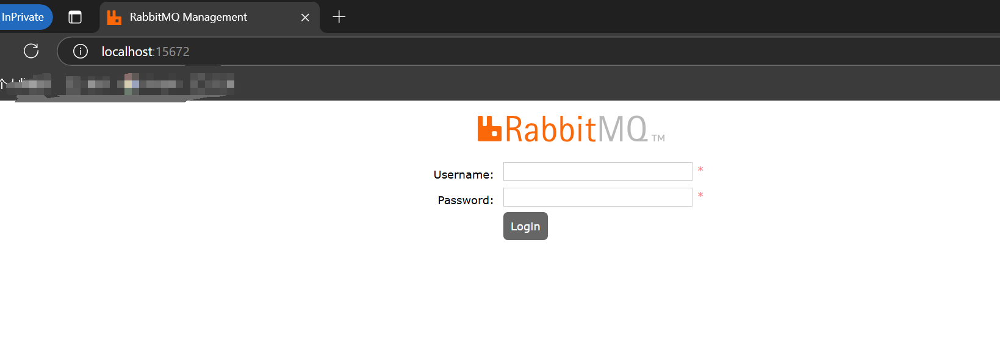

# Docker安装RabbitMQ

安装参考：[docker安装RabbitMQ教程(2023年最详细)-CSDN博客](https://blog.csdn.net/Relievedz/article/details/131081440)

1、拉取RabbitMQ镜像

```
docker pull rabbitmq
```

2、运行容器

```
docker run -d --hostname my-rabbit --name myrabbit -p 15672:15672 -p 5673:5672 rabbitmq
```

参数说明

-d 后台运行容器；

--name 指定容器名；

-p 指定服务运行的端口（5672：应用访问端口；15672：控制台Web端口号）；

-v 映射目录或文件；

--hostname  主机名（RabbitMQ的一个重要注意事项是它根据所谓的 “节点名称” 存储数据，默认为主机名）；

-e 指定环境变量；（RABBITMQ_DEFAULT_VHOST：默认虚拟机名；RABBITMQ_DEFAULT_USER：默认的用户名；

RABBITMQ_DEFAULT_PASS：默认用户名的密码）

3、进入容器并开启后台页面管理

```
docker exec -it myrabbit /bin/bash
```


开启后台管理页面

```
rabbitmq-plugins enable rabbitmq_management
```





# RabbitMQ交换机类型

## 1、direct

路由键与队列名完全匹配交换机，此种类型交换机，通过RoutingKey路由键将交换机和队列进行绑定，消息被发送到exchange时，需要根据消息的RoutingKey，来进行匹配，只将消息发送到完全匹配到此RoutingKey的队列。
比如:如果一个队列绑定到交换机要求路由键为“key”，则只转发RoutingKey标记为“key”的消息，不会 转发”key1"，也不会转发“key.1”等等。它是完全匹配、单播的模式


同一个key可以绑定多个queue队列；当匹配到key1时，queue1和queue2都可以接收到消息


## 2、fanout

扇出类型交换机，此交换机会将消息分发给所有绑定了此交换机的队列，此时RoutingKey参数无效


fanout类型交换机下，发送一条消息，无论Routingkey是什么，四个队列都能收到消息


## 3、topic

Topic，主题类型交换机，此种交换机与Direct类似，也是需要通过routingkey路由键进行匹配分发，区别在于Topic可以进行模糊匹配，Direct是完全匹配
1.Topic中，将routingkey通过".“来分为多个部分
2."*"：代表一个部分
3."#":代表0个或多个部分(如果绑定的路由键为"#"时，则接受所有消息，因为路由键所有都匹配)


​       然后发送一条信息，routingkey为key1.key2.key3.key4"，那么根据”."将这个路由键分为了4个部分，此条路由键将会匹配:
1、key1.key2.key3.**:成功匹配，因为*可以代表一个部分

2、key1.#:成功匹配，因为#可以代表0或多个部分

3、* .key2.*.key4: 成功匹配，因为第一和第三部分分别为key1和key3，且为4个部分，刚好匹配

4、#.key3.key4:成功匹配，#可以代表多个部分，正好匹配中了我们的key1和key2如果发送消息routingkey为"key1"，那么将只能匹配中key1.#，#可以代表0个部分

如果发送消息routingkey为“key1”，那么将只会匹配key1.#，#可以代表0个部分


## 4、headers

headers 匹配 AMQP 消息的 header 而不是路由键，此外headers 交换器和 direct 交换器完全一致，但性能差很多，目前几乎用不到消费方指定的headers中必须包含一个"x-match“的键。键“x-match"的值有2个

1、x-match = all ：表示所有的键值对都匹配才能接受到消息

2、x-match =any：表示只要有键值对匹配就能接受到消息

